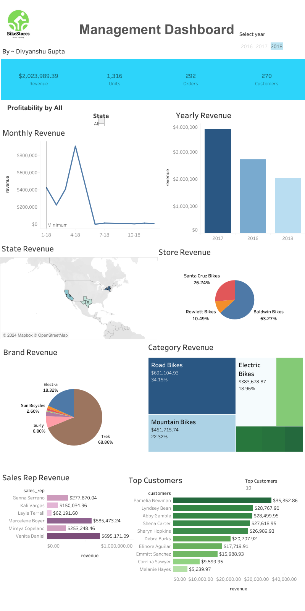

Tableau Dashboard Link:- https://public.tableau.com/app/profile/divyanshu.gupta7561/viz/BikeStoresDashBoard_17217583313840/Dashboard1

# Bike Stores Data Analytics Project

## Overview
This project involves analyzing data from a bicycle company with three stores across the U.S. (New York, California, Texas) over 3 years. The goal was to understand customer behavior, product performance, and sales trends.

## Data Collection and Processing
 1. Data Source: Data was sourced from SQL Server Tutorial as a SQL file.
 2. Data Extraction: Extracted data from SQL and organized it into multiple tables.
 3. Data Cleaning: Merged relevant columns, removed duplicates, and ensured data integrity.
 4. Analysis Tools: Data was imported into Microsoft Excel for analysis and visualization.

## Key Findings
### Yearly Revenue Trends:

2017: Highest revenue at $3,845,515 (41.9% growth from 2016).
2018: Lowest revenue at $2,023,989 (47.36% decline).

### Monthly Sales Trends:

Consistent sales increase from April to October in 2016 and 2017.
A significant sales surge in March 2018.
Product Performance:

Mountain Bikes: Top category with $3,030,776 in sales.
Road Bikes: $1,852,556.
Cruisers: $1,109,151.
Brand Performance:

Trek: Leading brand with $5,129,381 in revenue (59.79% of total sales).
Store Performance:

NY Baldwin Bikes: Best-performing store with $5,826,242 in sales (67.91% of total).
Santa Cruz Bikes: 20.87% of total sales.
Rowlett Bikes: 11.22% of total sales.
Sales Representatives:

Marcelene Boyer: Top performer with $2,938,888 in sales.
Venita Daniel: $2,887,353.
Genna Serrano: Third-ranked.

## Insights
 1. Seasonal Sales Trends: Identified seasonal patterns affecting sales. Useful for optimizing inventory and marketing strategies.
 2. Product and Brand Insights: Helps in promoting successful products and brands.
 3. Store Performance: Identifies areas for improvement in store operations.
 4. Sales Representatives: Provides data for better training and incentives.

## Impact and Applications
 1. Strategic Planning: Inform inventory and marketing strategies.
 2. Sales Optimization: Enhance training and incentives for sales representatives.
 3.  Customer Targeting: Tailor marketing efforts based on popular products and customer preferences.

